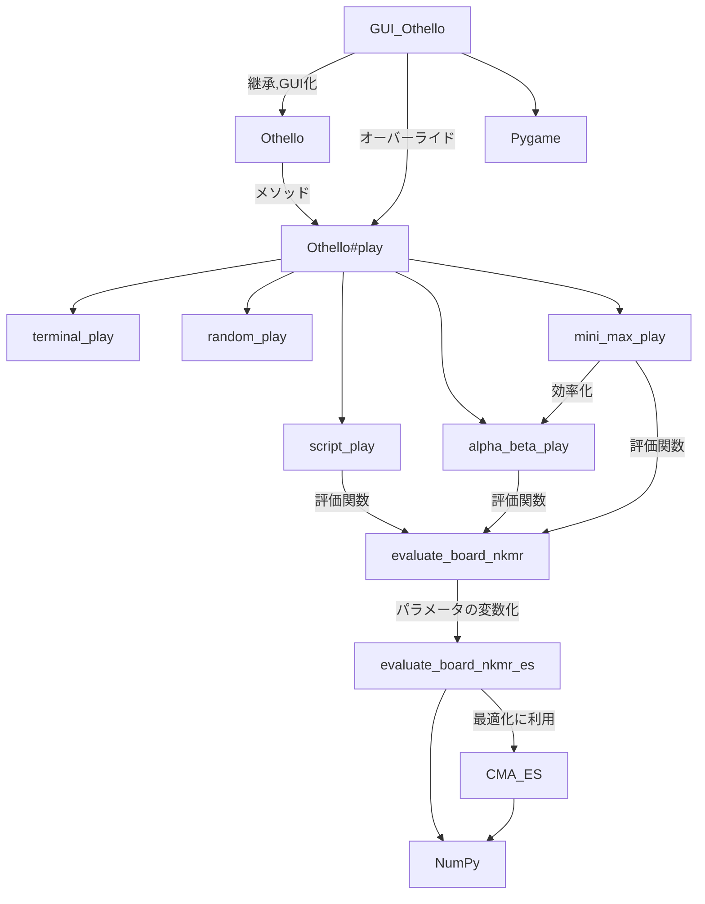
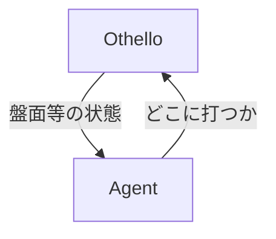
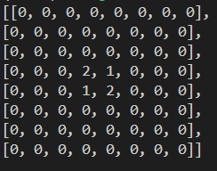
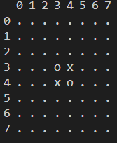

# OthelloAI

## 概観
## クラス,関数関係図



## links(あとで繋ぐ)
- [Othelloクラスの説明](#othelloクラスの説明)  
- [GUIOthelloクラスの説明](#gui_othello)
- play/の説明  
- evaluate/の説明  

## Getting Start
```python
from othello import Othello
from play.terminal_play import terminal_play
from play.random_play import random_play

othello=Othello()

othello.play(black=terminal_play,white=random_play,print=True,guide=True)
```
でオセロがターミナルで動きます。GUI_Othelloを使えばディスプレイ(?)で動きます。

#### 上記コードの解説
- playメソッドでゲームが動く
- これで、黒はターミナル入力、白はランダムでの対戦ができる
- printはターミナルにprintするか、guideはx,yを表示するかどうか
- black,whiteの引数には(Othello,int)->(x,y)の関数を渡す
   - 盤面の状況と自分の色を与えられると、どこに打つかを返す関数
   - 色と数字の対応は 0→なし,1→黒,2→白
- playメソッドはエージェント関数の返す値を使ってゲームを進めてく
- **より強いエージェント関数を作るのが目的**

> [!NOTE]
> どう考えてもrandom_playとかの命名はplayじゃなくてagentが良いが、めんどくさいので放置してる。だが以降こういった関数を`agent/エージェント関数`と呼びます。


### どうやってエージェント関数作るの？
##### 0.なにをするべきか理解する
- エージェント関数は盤面の状況と自分の色を与えられると、どこに打つかを返す関数です
- これは人が自分の色とオセロの盤面をみてどこに打つか決めるのと同じです



- 人工知能/AIとは人間の知能を模倣したものみたいな感じでふんわりと定義されています
- 自分の考え方をAgent関数としてコードに起こしたり、あるいは人間には出来ない量の計算結果を用いて最強のAgent関数を作りましょう。


##### 1. まず名前を決める.ここではexample_playとする
##### 2. play/example_play.pyを作成
##### 3. 下記をそこにコピペ

```python
from othello import Othello

def example_play(othello: Othello, color:int):
    #置けるセルを全て取得
    #ex:[(3,4),(5,2)]
    pos_puts=othello.possible_puts(color)
    return pos_puts[0]
```
##### 4. ルートディレクトリに適当にtest.pyファイルを作り以下をコピペ

test.py
```python
from othello import Othello
from play.example_play import example_play

othello=Othello()
othello.play(example_play)
```
- example_playと自分が対戦するコード
- 戦いながらコーディングするとよい

##### 5. ターミナルで`python test.py`
- これでtest.pyが動く

##### 6. example_playを強くする
  - Othelloクラスに生えているメソッドを使ったり、オセロの盤面の状況を読み取ったりしてどこに打つかを決めて(x,y)をreturnする。
  - 既にある機能を活用するためにも、Othelloクラスは理解して欲しいです。

> [!Warning]
> オセロのボードはothello.boardでアクセスできます。  
> 座標は**左上**が原点(x,y)=(0,0)でx軸は右向き,y軸は**下向き**です。  
> そしてothello.boardは左の画像ように定義されます。  
> よって、(x,y)にアクセスするには**othello.board[y][x]** となることに注意してください。  
>   


## Othelloクラスの説明
重要度順にプロパティ、メソッドの説明があります。

### Othello#board
オセロの盤面を表す二次元配列です。

### Othello#history
オセロの打たれた手の履歴のリストです。
ex:`[[(3,4),(2,3)]]`
また、othello.pyファイルにhistoryからOthelloを返す関数`fromHistory`があります


### Othello#play
オセロのゲームをシミュレートする関数です
#### 定義
```python
def play(
        self,
        black:Callable[[Self, int], tuple[int, int]] = terminal_play,
        white:Callable[[Self, int], tuple[int, int]] = terminal_play,
        print: bool = True,
        guide: bool = True,
    ) -> int
```
#### 引数
- black,white エージェント関数を与えます
- print Trueだと打ったあとにprintします
- guide Trueだとprintされた座標がわかりやすいようにprintします

#### 返り値
- 勝った色を返します

### Othello#possible_puts
与えられた色の置けるセルを全て返します

#### 定義
```python
def possible_puts(self, color: int) -> list[tuple[int,int]]
```
#### 引数
- color 判定する色です
#### 返り値
置けるセルのリストです
ex:`[(3,4),(5,6)]`


### Othello#is_possible_to_put_anywhere
与えられた色がどこかに置けるセルが存在するかどうかを返します
#### 定義
```python
def is_possible_to_put_anywhere(self, color: int) -> bool
```
#### 引数
- color 判定する色です
#### 返り値
おける場所が存在したらTrueを返します

### Othello#count

#### 定義
盤面にそれぞれの色が何個あるかを返します
```python
def count(self)->tuple[int,int,int]
```

#### 返り値
盤面にそれぞれの色、順に空,黒,白が何個あるかです。
ex:`(60,2,2)`


### Othello#reverse_len
点(x,y)と色が与えられると、そこにその色を置いたときに、上から時計回り8方向のひっくり返せる数を返します

#### 定義
```python
def reverse_len(self, x: int, y: int, color: int) -> list[int]
```
#### 引数
- x x座標です
- y y座標です
- color 判定したい色です

#### 返り値
上から時計回り8方向に何個ひっくりかえせるかです
ex:[1,0,3,0,0,1,0,0]


### Othello#put
点(x,y)にcolorをおき、成功したらTrueを返します。ひっくり返してくれます
```python
def put(self, x: int, y: int, color: int) -> bool
```

## GUI_Othello
pygameを用いてOthelloをGUIで表示できるようにOthelloクラスを拡張したやつです。playメソッドのみを変更しています。

### GUI_Othello#play
#### 定義
```python
def play(
        self,
        black=None,
        white=None,
    ):
```
#### 引数
- black,white エージェント関数を与えます。Noneのときはマウスクリックで打つようになります。


# 参考文献
- オセロAIの教科書 https://note.com/nyanyan_cubetech/n/n210cf134b8b1?magazine_key=m54104c8d2f12
- ゼロから教えるゲーム木探索入門 https://qiita.com/thun-c/items/058743a25c37c87b8aa4
- BBOLab CMAESの解説 https://www.bbo.cs.tsukuba.ac.jp/research-j/cmaes%E9%80%B2%E5%8C%96%E6%88%A6%E7%95%A5%E3%81%AE%E8%A7%A3%E8%AA%AC