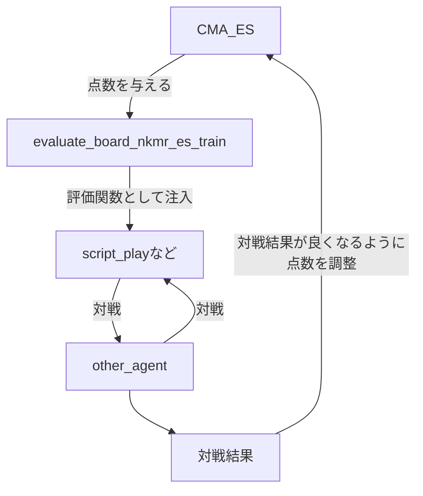

# evaluate/の説明
評価関数を置いておく所です。

## 評価関数とは?
オセロの盤面と色を受け取ってその色からしたオセロの盤面の評価値を返す関数です。評価値は高ければ高いほどその色にとって良いです。
script_play,mini_max_play,alpha_beta_playに使われます。  
これらのエージェントの強さや計算量はその評価関数に強く依存するので、より正確な評価関数を作る必要があります。正確であれば浅い探索でも十分な強さになります。


> [!NOTE]
> オセロはゼロサムゲームなので一方から見て良い盤面は他方からみて悪い盤面です。つまり一方から見た評価値の-1倍が他方から見た評価値となります。これを利用して評価関数を作ると場合分けが減って楽になります。

### 定義
```python
def some_evaluate_func(board:list[list[int]],color:int)->int
```
### 引数
- board:評価すべきオセロの盤面です
- color:評価する視点を定める色です

### 返り値
その色から見た盤面の評価値です

### 簡単な実装例
ちゃんとしたやつは [evaluate/evaluate_board_nkmr](./evaluate_board_nkmr.py)を見てください。ここでは簡単なやつを紹介します。オセロの盤面をみて、自分の色の数-相手の色の数で評価する関数です。
```python

def evaluate_by_count(board,color):
  o=Othello()
  o.board=board
  _,b,w=o.count()
  if color==1:
    return b-w
  else:
    return w-b

```


### エージェント関数への適用のしかた

```python
agent=alpha_beta_play(3,some_evaluate_func)
othello.play(agent)
```

## 進化的戦略(CMA_ES)について
`evaluate_board_nkmr`関数は自分のドメイン知識で作成しています。なので角が評価値200点とか隅一列が100点とかは適当に決めています。なのでその点数という点においてこの関数はより正確に出来ると考えられます。ここで、その点数を変数とした評価関数`evaluate_board_nkmr_es_train`を作成して、その評価関数を`script_play`などに用いて他のエージェントと戦い、勝ち越した数を最大化するようにしました。



これによって最適化されたのが`evaluate_board_nkmr_es`です。またCMA_ESの進化過程のアウトプットは`es_output`ディレクトリにあります。

CMA_ESについては以下を参照してください
- BBOLab CMAESの解説 https://www.bbo.cs.tsukuba.ac.jp/research-j/cmaes%E9%80%B2%E5%8C%96%E6%88%A6%E7%95%A5%E3%81%AE%E8%A7%A3%E8%AA%AC


